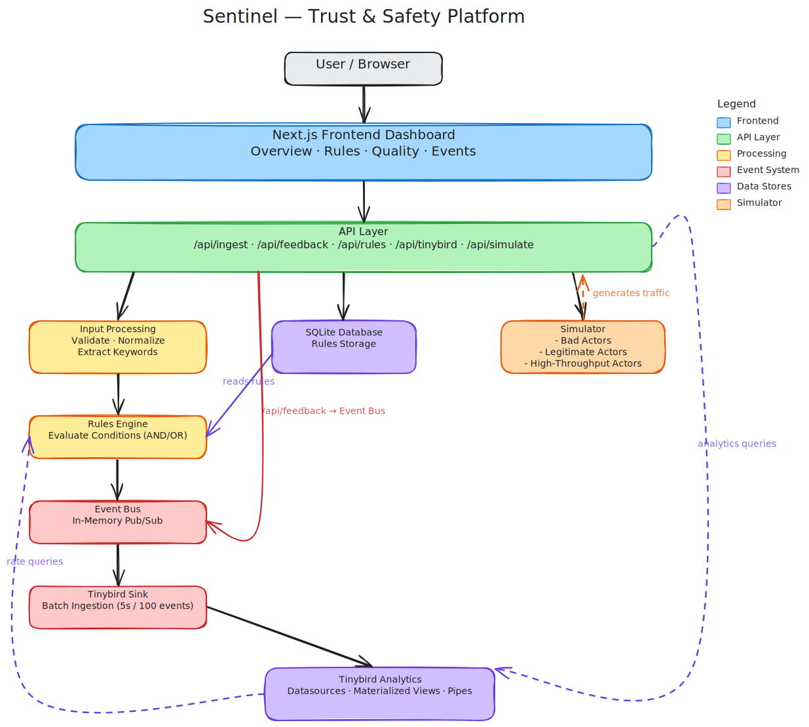

# Sentinel

Real-time Trust & Safety platform for email delivery. Sentinel evaluates email send requests against configurable rules, detects abuse patterns, and provides real-time analytics and monitoring dashboards.

#### Imporant Note
This project is a **proof-of-concept** designed to demonstrate the feasibility of building a real-time T&S platform. 
It is not production-ready and has several limitations in terms of scalability, reliability, and security. 
The architecture and implementation choices prioritize simplicity and clarity over robustness and performance for demonstration purposes.
More details on limitations and future work are covered in the respective sections below.

**Note on Tinybird Free Tier limitations:**
- The daily quota for the free tier is <span style="color:red;">1k events per day</span>, which includes both data ingested and queried. The simulator generates a small but significant number of events, so you may hit the quota limit quickly. To mitigate this, events are batched before being written to Tinybird, auto-refresh is disabled by default, and the rate of new events is low. In addition during testing, you can:
  - Reduce the number of personas and their sending rates in the simulator configuration.
  - Focus on testing specific features or rules rather than running the full simulation continuously.

## Table of Contents

- [Local Setup](#local-setup)
- [Deployment](#deployment)
- [Architecture](#architecture)
  - [Frontend](#frontend)
  - [API Layer](#api-layer)
  - [Data Stores](#data-stores)
  - [Simulator](#simulator)
  - [Event System](#event-system)
- [PoC Limitations & Production Readiness](#poc-limitations--production-readiness)
- [Future Work](#future-work)

## Local Setup

### Prerequisites

- Node.js 20+
- A [Tinybird](https://www.tinybird.co/) workspace with the datasources and pipes deployed (see `tinybird/` directory)

### Installation

```bash
# Install dependencies
npm install

# Copy environment config and fill in your Tinybird token
cp .env.local.example .env.local
```

### Environment Variables

| Variable | Description |
|----------|-------------|
| `TINYBIRD_API_URL` | Tinybird API base URL (default: `https://api.tinybird.co`) |
| `TINYBIRD_ADMIN_TOKEN` | Tinybird token with pipe read and datasource append permissions |
| `DATABASE_URL` | Path to the SQLite database file (default: `./sentinel.db`) |

### Running Locally

#### Tinybird Local Development
```bash
# local installation (recommended for development)
curl https://tinybird.co | sh - # Install Tinybird CLI and the local container
cd tinybird
tb login
tb local start
# In another terminal, push resources to local Tinybird instance
cd tinybird && tb deploy

Update .env.local with your Tinybird token 
(run 'tb token ls' pick admin local_testing@tinybird.co or find one in tb logs) 
and API URL (for local: http://localhost:7181)
```

#### Prepopulate Database and Start Server
```bash
# Seed the database with default rules
npm run db:generate
npm run db:seed

# Start the development server
npm run dev
```

The app will be available at `http://localhost:3000`.

### Available Scripts

| Script | Description |
|--------|-------------|
| `npm run dev` | Start Next.js development server |
| `npm run db:generate` | Generate Drizzle ORM migrations |
| `npm run db:migrate` | Run database migrations |
| `npm run db:seed` | Seed database with default rules |

## Deployment

### Tinybird

The `tinybird/` directory contains all datasource and pipe definitions. Push them to your Tinybird workspace using the [Tinybird CLI](https://www.tinybird.co/docs/cli):

```bash
cd tinybird
tb login # Authenticate with your Tinybird account
tb --cloud deploy
tb --cloud token create static <name> --scope <scope>

In Railway set tocken and API URL
```

### Railway

The project includes a `railway.toml` for deployment to [Railway](https://railway.app/):

```toml
[build]
builder = "NIXPACKS"

[deploy]
startCommand = "npm run db:generate && npm run db:seed && npm run start"
healthcheckPath = "/"
healthcheckTimeout = 100
restartPolicyType = "ON_FAILURE"
restartPolicyMaxRetries = 10
```

Set the following environment variables in Railway:

| Variable | Value                                                            |
|----------|------------------------------------------------------------------|
| `DATABASE_URL` | `/data/sentinel.db` (use a persistent volume mounted at `/data`) |
| `TINYBIRD_API_URL` | `Your Tinybird project API URL`                                  |
| `TINYBIRD_ADMIN_TOKEN` | Your Tinybird admin token                                        |
| `NODE_ENV` | `production`                                                     |

## Architecture



The system follows an event-driven architecture with a clear separation between ingestion, evaluation, and analytics.

### Frontend

The frontend is a Next.js 16 application with React 19, Tailwind CSS, and Recharts. It consists of four main pages:

| Page | Path | Description |
|------|------|-------------|
| **Overview** | `/` | Summary KPIs (total requests, block rate, active threats, flags), throughput and decision charts in 10-second buckets, delivery outcome trends, active threats table, and top blocked accounts |
| **Rules** | `/rules` | Create, edit, enable/disable, and delete rules. Each rule has conditions with operators (`eq`, `gt`, `lt`, `contains`, `matches`, `rate_exceeds`), logic (`AND`/`OR`), severity levels, and block/flag actions |
| **Quality** | `/quality` | Email quality metrics: detection rate, complaint rate, bounce rate, delivery success rate, and a ranking of problem accounts |
| **Events** | `/events` | Ad-hoc event search with filters by account, domain, decision action, delivery status, and time range |

Data fetching uses [SWR](https://swr.vercel.app/) via a `useTinybird()` hook that queries the Tinybird API through the backend proxy. Dashboards auto-refresh every 15 seconds (toggleable via the UI). A built-in simulator control panel allows starting/stopping traffic generation and spawning individual personas directly from the dashboard.

### API Layer

All endpoints are Next.js API routes under `src/app/api/`.

#### `POST /api/ingest`

Processes an email send request through the rules engine and returns a decision.

**Request body:**

```json
{
  "eventId": "uuid",
  "timestamp": "2025-01-15T10:30:00.000Z",
  "sender": {
    "accountId": "acme_123",
    "email": "noreply@acme.com",
    "domain": "acme.com",
    "ip": "192.168.1.1"
  },
  "recipient": {
    "email": "user@example.com",
    "domain": "example.com"
  },
  "content": {
    "subject": "Your order has shipped",
    "body": "...",
    "hasLinks": true,
    "linkCount": 1,
    "hasAttachments": false,
    "bodyLengthBytes": 450
  },
  "metadata": {
    "region": "us-east-1",
    "userAgent": "sender-app/1.0"
  }
}
```

**Response:**

```json
{
  "eventId": "uuid",
  "decision": "allow",
  "reason": "Allowed: No rules matched - event passed all checks"
}
```

**Processing pipeline:**
1. Validate input against the Zod schema
2. Normalize emails/domains to lowercase, trim whitespace
3. Extract suspicious keywords from subject + body (18 predefined terms: `verify`, `account`, `security`, `paypal`, `credential`, `password`, `login`, etc.)
4. Load active rules from SQLite
5. Evaluate conditions (rate-based conditions query Tinybird, others evaluate in-memory)
6. First matching rule wins; default is `allow`
7. Publish `send_request_processed` event to the event bus (async, non-blocking)

#### `POST /api/feedback`

Reports delivery status for a previously ingested email.

**Request body:**

```json
{
  "feedbackId": "uuid",
  "eventId": "uuid",
  "timestamp": "2025-01-15T10:30:05.000Z",
  "status": "delivered",
  "detail": "Delivered to inbox"
}
```

Status values: `delivered`, `bounced`, `complained`, `opened`, `clicked`.

Publishes a `delivery_feedback_received` event to the event bus.

#### `GET/POST/PATCH/DELETE /api/rules`

Full CRUD for rule management.

| Method | Path | Description |
|--------|------|-------------|
| `GET` | `/api/rules` | List all rules |
| `POST` | `/api/rules` | Create a rule |
| `PATCH` | `/api/rules/[id]` | Partially update a rule |
| `DELETE` | `/api/rules/[id]` | Delete a rule |

A rule condition supports these operators:

| Operator | Description | Example |
|----------|-------------|---------|
| `eq` | Exact match | `sender.domain` eq `"spam.com"` |
| `gt` | Greater than | `content.linkCount` gt `5` |
| `lt` | Less than | `content.bodyLengthBytes` lt `500` |
| `contains` | String/array contains (case-insensitive) | `content.suspiciousKeywords` contains `"verify"` |
| `matches` | Regex pattern (case-insensitive) | `sender.domain` matches `"paypa[l1]"` |
| `rate_exceeds` | Event count exceeds threshold in time window | `sender.accountId` rate_exceeds `10` window `"1m"` |

#### `GET /api/tinybird/[pipe]`

Proxy to Tinybird query pipes. Converts ISO datetime parameters to Tinybird DateTime64 format. Allowed pipes: `overview_summary`, `requests_per_10s`, `blocks_per_10s`, `active_threats`, `top_blocked_accounts`, `quality_summary`, `problem_accounts_top`, `event_explorer`, `account_event_count`, `delivery_outcomes_pivoted`.

#### `GET/POST /api/simulate`

Controls the traffic simulator. `GET` returns status; `POST` accepts actions: `start`, `stop`, `spawn_bad_actor`, `spawn_legitimate`, `spawn_high_throughput`, `remove_persona`.

### Data Stores

#### SQLite (Rules Storage)

Local SQLite database managed by [Drizzle ORM](https://orm.drizzle.team/). Stores rule definitions only.

**`rules` table schema:**

| Column | Type | Description |
|--------|------|-------------|
| `id` | text, PK | Unique rule identifier |
| `name` | text, not null | Rule name |
| `description` | text | Human-readable description |
| `status` | text (`active` / `disabled`) | Whether the rule is evaluated |
| `conditions` | text | JSON-encoded array of conditions |
| `logic` | text (`AND` / `OR`) | How conditions combine |
| `action` | text (`block` / `flag`) | Action when rule matches |
| `severity` | text (`critical` / `high` / `medium` / `low`) | Severity level |
| `createdAt` | text | ISO 8601 timestamp |

**Default seeded rules:**

| Rule | Condition | Action | Severity |
|------|-----------|--------|----------|
| Phishing detection | `content.subject` contains "verify your account" | block | critical |
| Volume spike | `sender.accountId` rate exceeds 2/min | block | high |
| Domain spoofing | `sender.domain` matches `paypa[l1]\|arnazon\|g00gle\|micr0soft` | block | critical |
| Suspicious links | `content.linkCount` > 5 AND `bodyLengthBytes` < 500 | flag | medium |
| Credential harvesting | `content.subject` contains "login" OR `suspiciousKeywords` contains "credential" | block | high |

#### Tinybird (Analytics)

[Tinybird](https://www.tinybird.co/) handles all time-series analytics. Data is ingested as NDJSON via the Events API and queried through endpoint pipes.

**Datasources (streaming ingestion):**

| Datasource | Sort Key | Key Fields |
|------------|----------|------------|
| `send_requests` | `timestamp, sender_account_id` | event_id, sender (account/email/domain/ip), recipient, content (subject, link_count, body_length, suspicious_keywords[]), metadata |
| `decisions` | `timestamp, action` | event_id, rule_id, rule_name, action (`block`/`flag`/`allow`), severity, reason |
| `delivery_feedback` | `timestamp, event_id, status` | feedback_id, event_id, status (`delivered`/`bounced`/`complained`/`opened`/`clicked`), detail |

All datasources use `MergeTree` engine partitioned by `toYYYYMM(timestamp)`.

**Materialized views (10-second aggregations):**

| View | Purpose |
|------|---------|
| `requests_10s_mv` | Request count and unique senders per 10s bucket |
| `decisions_10s_mv` | Decision counts (block/flag/allow) per 10s bucket |
| `decisions_by_rule_10s_mv` | Hit counts per rule, severity, and action per 10s |
| `delivery_feedback_10s_mv` | Feedback counts by status per 10s bucket |

**Endpoint pipes (query API):**

| Pipe | Purpose | Key Parameters |
|------|---------|----------------|
| `overview_summary` | Total requests, blocks, flags, block rate | `start_time` |
| `requests_per_10s` | Throughput chart data | `start_time` |
| `blocks_per_10s` | Block/flag/allow counts per bucket | `start_time` |
| `active_threats` | Rules triggering blocks in last 5 min | `start_time` |
| `top_blocked_accounts` | Most blocked sender accounts | `start_time` |
| `quality_summary` | Detection, complaint, bounce, delivery rates | `start_time` |
| `problem_accounts_top` | Accounts with highest bounce/complaint rates | `start_time`, `limit` |
| `event_explorer` | Full event search with joins | `account_id`, `domain`, `decision_filter`, `delivery_status`, `start_time`, `end_time`, `limit`, `offset` |
| `account_event_count` | Event count for an account in a window (used by rules engine) | `account_id`, `window_seconds` |
| `delivery_outcomes_pivoted` | Delivery statuses per 10s bucket | `start_time` |

### Simulator

The simulator generates realistic email traffic to test rules and populate dashboards. It runs in-process, controlled via the `/api/simulate` endpoint or the dashboard UI.

**How it works:**

1. The simulator ticks every **100ms** (10 ticks/second). Each active persona accumulates fractional events per tick based on its configured rate.
2. When a persona's accumulator reaches >= 1, it generates that many email events and POSTs them to `/api/ingest` (up to 10 concurrent requests per tick).
3. The simulator automatically stops after **5 minutes**.

**Persona types:**

| Type | Count | Rate | Description                                                                                                                                                                                                     |
|------|-------|------|-----------------------------------------------------------------------------------------------------------------------------------------------------------------------------------------------------------------|
| **Bad actors** | 5 profiles | 3/min each | Designed to trigger specific rules. Includes phishing (`security-alerts.net`), domain spoofing (`paypa1-secure.com`), high-volume blasting, suspicious content (8+ links, tiny body), and credential harvesting |
| **Legitimate** | 5 profiles (max 5 active) | 1/min each | Clean senders: Shopify, Amazon Seller, Etsy, Stripe, Square notifications. No suspicious keywords, normal link counts                                                                                           |
| **High-throughput legitimate** | 2 profiles | 3/min each | Black Friday promos and product launches. Same clean content as legitimate but higher volume - tests that rate rules don't false-positive on honest traffic                                                     |

**Feedback generation:** for emails that are not blocked, the simulator schedules synthetic delivery feedback after a 2-4 second delay:
- Legitimate emails: delivered, bounced, opened, clicked
- Bad actor emails:  delivered, bounced, complained, opened

The feedback queue is bounded (max 500 pending, 2000 queued) and processes in batches of 10.

### Event System

The event bus is an in-memory publish/subscribe system that decouples the API response from analytics ingestion.

**Flow:**

```
/api/ingest          /api/feedback
     |                    |
     v                    v
  [Event Bus - In-Memory Pub/Sub]
     |
     v
  [Tinybird Sink]
     |  Buffers events, flushes every 5s or at 100 events
     |  Retries on failure (3 attempts, exponential backoff)
     v
  [Tinybird API - NDJSON ingestion]
```

**Event types:**
- `send_request_processed` - carries the full `SendRequest` and `Decision` (with severity)
- `delivery_feedback_received` - carries the `DeliveryFeedback`

Handlers run asynchronously via `queueMicrotask()`, so API responses are never blocked by analytics ingestion. Errors in subscribers are caught and logged independently.

The Tinybird sink subscribes to both event types and maps them into three datasources (`send_requests`, `decisions`, `delivery_feedback`). Events are buffered in-memory and flushed in batches (NDJSON format) to the Tinybird Events API. Failed ingestions retry up to 3 times with exponential backoff (100ms * attempt number). \

The retry logic may potentially **duplicate** events in Tinybird if the same batch is retried multiple times, as there is no idempotency mechanism. 
**This is a known limitation of the PoC implementation - covered in Reliability section.**

## PoC Limitations & Production Readiness

This is a proof-of-concept. The following areas need work before production use:

### Scalability

- **In-memory event bus** - events are lost on process restart. Replace with a durable message queue (Kafka, SQS or Redis Streams) for at-least-once delivery guarantees.
- **SQLite** - single-file database does not support concurrent writes from multiple instances. Migrate to PostgreSQL or a managed database for horizontal scaling.
- **Single-process architecture** - the simulator, rules engine, event bus, and Tinybird sink all run in the same Node.js process. Separate these into independent services for independent scaling.
- **In-memory batch buffers** - the Tinybird sink buffers up to 100 events in memory before flushing. An OOM or crash loses the buffer. Use a write-ahead log or durable queue.

### Reliability

- **No dead-letter queue** - failed Tinybird ingestions are retried 3 times and then silently dropped. Add a DLQ for failed events.
- **No idempotency** - duplicate `POST /api/ingest` calls produce duplicate decisions and analytics data. Add idempotency keys based on `eventId`.
  - Make /api/ingest idempotent at write-time
  - Make Tinybird ingestion idempotent by deduplicating on `event_id` (requires schema change and pipe updates e.g. using `ReplacingMergeTree` with deduplication key)
- **No circuit breaker** - if Tinybird is down, rate-based rules silently skip evaluation. Add circuit breaker patterns and fallback behavior.
- **No backpressure** - the event bus accepts unlimited events regardless of downstream capacity.

### Security

- **No authentication/authorization** - all API endpoints are public. Add API key validation, rate limiting, and Role Based Access Control.
- **Tinybird token exposure** - the admin token is used server-side but a misconfiguration could leak it. Use scoped tokens with minimal permissions.
- **No input sanitization beyond Zod** - regex patterns in rules are user-provided and could cause ReDoS. Add regex complexity limits.

### Observability

- **Console-only logging** - replace with structured logging (e.g. Pino) and ship to a log aggregation service.
- **No metrics** - add application metrics (request latency, rule evaluation time, queue depth, error rates) and export to Prometheus/Datadog.
- **No alerting** - add alerts for anomaly detection (sudden block rate spikes, Tinybird ingestion failures, queue backlog growth).

### Data Integrity

- **No data retention policy** - Tinybird datasources grow indefinitely. Add TTL-based retention.
- **No schema versioning** - changing the event schema requires manual migration of Tinybird datasources.
- **Materialized views are eventually consistent** - 10-second aggregation windows mean dashboards can be up to 10 seconds behind reality.

## Future Work

### Additional Detection Capabilities

- **ML-based scoring** - train a model on historical block/complaint data to assign a risk score to each email, complementing rule-based evaluation. Use Tinybird's historical data as the training set.
- **Reputation system** - track per-account reputation scores based on complaint rates, bounce rates, and rule violations over time. Automatically throttle or block accounts that cross thresholds.
- **IP/ASN intelligence** - enrich sender IP data with ASN lookups and geolocation. Detect sends from known bad networks or unexpected geographic shifts.
- **Recipient-side signals** - track per-recipient domain engagement (open rates, complaint rates) to detect domains where deliverability is degrading.
- **Suspected false negatives automation** - automatically block accounts that have high complaint / bounce rates but are not currently triggering any rules, by creating new rules based on their behavior patterns.

### Analytics & Insights

- **Cohort analysis** - compare new accounts vs. established accounts in terms of block rates, complaint rates, and sending patterns.
- **Time-series anomaly detection** - use Tinybird's aggregated data to detect statistical anomalies in send volume, block rate, or complaint rate per account.
- **Rule effectiveness dashboard** - track false positive rates per rule by correlating rule matches with downstream delivery feedback. Surface rules that flag legitimate traffic.
- **Sender onboarding funnel** - track new account progression from first send to steady state, identifying accounts that ramp too aggressively.
- **Exportable reports** - scheduled PDF/CSV reports for trust & safety teams with weekly summaries, top offenders, and rule performance.

### Platform Improvements

- **Webhook/callback support** -- notify external systems (Slack, PagerDuty, custom endpoints) when high-severity rules trigger or block rates spike.
- **Rule versioning and audit log** -- track who changed what rule and when. Support rollback to previous rule versions.
- **A/B testing for rules** -- evaluate new rules in shadow mode (log matches without acting) before promoting to active enforcement.
